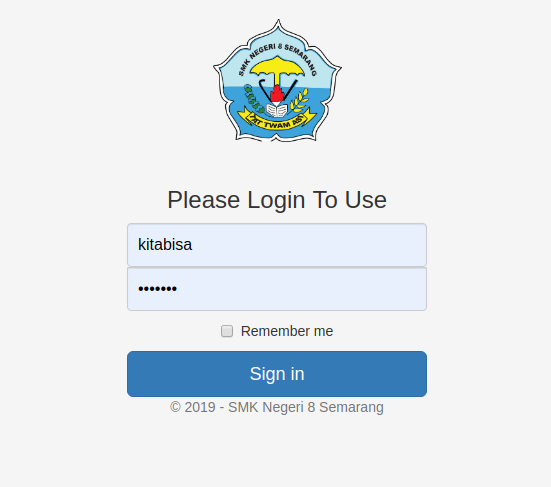

# LampuRaspiIOT
Simple Node.JS Webserver for controlling Raspberry Pi with Login Page for access.

## Settings

The following environment variables are supported:

 - `PORT` - The port the webserver runs at. (default 80)

***The [dotenv](https://github.com/motdotla/dotenv) environment is supported.***

credit (english): https://tutorials-raspberrypi.com/setup-raspberry-pi-node-js-webserver-control-gpios/
